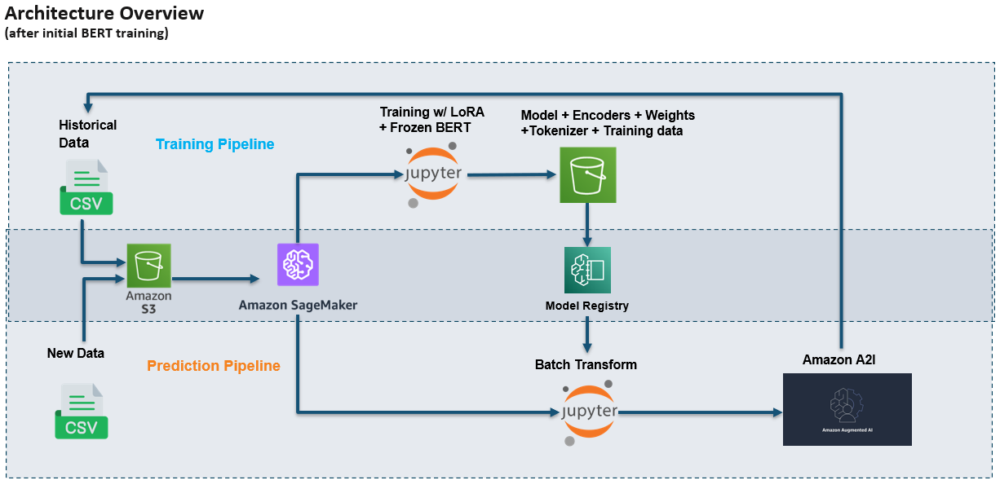
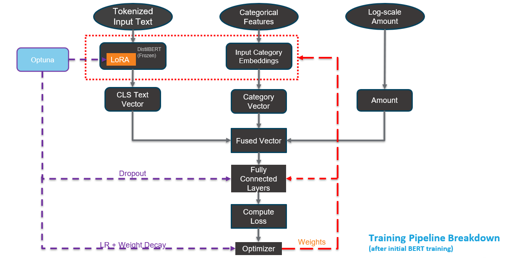

# Procurement Spend Classification ML Pipeline

An end-to-end machine learning pipeline on AWS SageMaker that automatically classifies healthcare purchased-service spend into ~345 spend categories.

## The problem

Healthcare spend records (vendor names, GL descriptions, memos, departments, amounts) had to be sorted into spend categories by hand before they could be used for benchmarking and savings analysis. The process was slow and held up client deliverables.

## The solution

A hybrid deep learning classifier that reads the text of each transaction **and** uses its structured fields, wrapped in automated SageMaker pipelines for training and batch prediction.

- **Text:** vendor name, GL description, memo, and department are combined, cleaned (lowercasing, stopword removal, lemmatization), and encoded with **DistilBERT**.
- **Structured features:** hospital system, primary category, and category hierarchy are learned as embeddings; the transaction amount is added as a numeric feature (with IQR outlier clipping).
- **Fusion:** the text vector, category embeddings, and amount are combined and passed through fully connected layers to predict the spend category.
- **Class imbalance:** handled with class-weighted loss and oversampling of rare categories.
- **Confidence routing:** every prediction gets a confidence score. Predictions below 0.8 are written to a separate low-confidence file for human review; high-confidence predictions can flow straight into reporting.

## Architecture





> The diagrams show the full architecture design. LoRA fine-tuning, Optuna hyperparameter tuning, the Model Registry, and Amazon A2I human review are **not** included in this repository. The code here implements the core training and batch prediction pipelines.

### Training pipeline (`SageMaker/TrainingPipeline.ipynb`)
1. **Processing job** (`preprocess_train_file_sagemaker.py`): reads raw CSVs from S3, cleans and merges them, encodes categorical fields, removes categories with a single example, and saves the processed data and encoders back to S3.
2. **Training job** (`train_sagemaker.py`, GPU instance): trains the hybrid DistilBERT model, tracks loss, accuracy, weighted F1, and top-3 and top-5 accuracy each epoch, and saves the best model (by F1) plus logs to S3.

### Prediction pipeline (`SageMaker/PredictionPipeline.ipynb`)
1. **Processing job** (`preprocess_test_file_sagemaker.py`): applies the same cleaning and saved encoders to new data.
2. **Prediction job** (`predict_sagemaker.py`): loads the trained model, predicts a category for every record, and writes all, high-confidence, and low-confidence predictions to S3.

## Repository structure

```
SageMaker/   Pipeline notebooks and the scripts each SageMaker job runs
Local/       The same workflow as standalone scripts for running locally
StepExplanation.md   Step-by-step technical walkthrough
```

## Tech stack

Python, PyTorch, Hugging Face Transformers (DistilBERT), scikit-learn, pandas, NLTK, AWS SageMaker (Processing, Training, Pipelines), Amazon S3, TensorBoard

## Running it

1. Install dependencies: `pip install -r requirements.txt`
2. Put your training data (`TRAIN.csv`, `list_of_categories.csv`) in S3.
3. In the notebooks and `train_sagemaker.py`, replace `your-bucket` / `your-prefix` with your S3 location.
4. Run `TrainingPipeline.ipynb`, then point `PredictionPipeline.ipynb` at the trained model and run it.

To run locally instead, set `base_path` in the scripts under `Local/` to the folder containing your CSVs and run them in order: preprocess train → train → preprocess test → predict.

*Data is not included. The original data is proprietary.*
